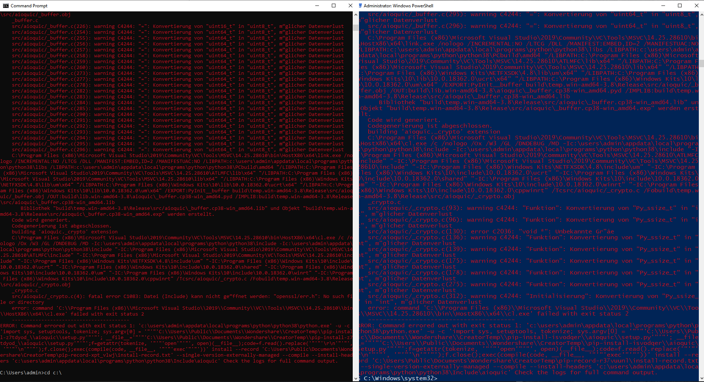

# AIOQUIC PyCharm IDE Setup on Windows 10  
The following describes [aioquic](https://github.com/aiortc/aioquic) 
installation and PyCharm setup on a Windows 10 machine step-by-step.

## Issue and workaround  
With IETF's specification of the QUIC transport procotol being still being in development 
(at the time of writing in 
[draft no.27](https://www.ietf.org/id/draft-ietf-quic-transport-27.html)) the *aioquic* library
is as well undergoing changes. 

At the time of writing the pip install command will work in Linux, but not in Windows (see below)

    pip install aioquic  

 Result:  

### Update April 17 '20 - resolved in aioquic 0.8.7

The in new **aioquic version 0.8.7** this issue no longer persists. Aioquic can be
installed with pip command: 

 

### Step One - Chocolatey
Search for "Windows PowerShell" in Start, then run it as an administrator 
(from the right-click context-menu). Then follow on the point 2. of the 
[chocolatey installation guide](https://chocolatey.org/install) 
(where also other installation options are included).

### Step Two - OpenSSL
Once Chocolatey is installed, you can run the following command to install OpenSSL 
in the PowerShell

    choco install openssl
    
After that you can setup the variable path in the PowerShell with

    $Env:CL = "/IC:\Progra~1\OpenSSL-Win64\include" 
    $Env:LINK = "/LIBPATH:C:\Progra~1\OpenSSL-Win64\lib" 
  
### Step Three - download and install aioquic
Go to the [aioquic GitHub repository](https://github.com/aiortc/aioquic) and download it to your local
hard drive. Then navigate to the local directory in PowerShell or Command Prompt and 
install from the locally saved aioquic files you downloaded with:   

    pip install -e .
    
### Step Four - install  other dependencies
Aioquic runs depends on the following addtitional libraries:

    pip install aiofiles 
    pip install asgiref 
    pip install httpbin 
    pip install starlette 
    pip install wsproto

### Step Five - Setup PyCharm
The installations in PyCharm's virtual environment using the pip command results in the same
error as in the PowerShell and Command Prompt (see above). You can however add the modules needed
to run the tests, exmaples and your own code manually directly in PyCharm (see below).

Note that if you created a new virtual environment, you need to make sure, that all other
dependencies (mentioned above) are also included/installed. A runnable setup on my machine 
looks as follows:

### Step Six - TROUBLESHOOT

It is possible that you after you took the steps one to five, the examples still do not 
run in your PyCharm. Two possible reasons are:

- **Error modules not found**: e.g. *certifi* and *cryptography* were missing in my virtual 
environment. First thing good to check when this error comes up might be if the missing module 
comes in the Python version you are trying to use. In my setup I used Python 3.8, 
from my short research, the current aioquic's dependencies are e.g. not compatible
with Python 3.6.0.

- **Connection Error**: This error basically means that the client could not connect to the 
server-app on the local host. The examples in the aioquic project run by default on the 
localhost/port 4433. Since the aioquic is proven to run correctly, there might be an 
issue with your machine's setup. A good way to isolate the problem is to start the 
server-app and then run the command -

      netstat -na 
    This shows the active port. Normally, you would be looking if the server port is listening.
    The status is however shown for TCP ports only. Nevertheless, in the lower UDP 
    section you will hopefully find 
    your port running with an assigned PID. In my first try, no
    PID was assigned to the port - hence no connection was possible. 
    Netstat was showing only:
    
      UDP [::]:4433 
    
    In my second try the port was bound to ::1 which should signal the local host. 
    Yet PyCharm 
    would still not connect when running the client application. 
                                             
      UDP [::1]:4433
      
    I therefore declared the host's IP explicitly (127.0.0.1) in the parameters 
    for the server: 
                                                                                                                                                                                                                                                                                                                                                                                                                                                                                                                                                                                                                                                                
      --certificate certificates/ssl_cert.pem --private-key certificates/ssl_key.pem --verbose --host 127.0.0.1 --port 4433
      
    Netstat was then showing the UDP port 4433 open as:
     
      UDP 127.0.0.1:4433
    
    which then made connecting with the client possible when the following parameters 
    were used: 
    
       --print-response --ca-certs certificates/pycacert.pem wss://127.0.0.1:4433/ws --verbose
   
    These parameters need to be entered in the pycharm's run configurations for each runnable 
    file (see below)

   