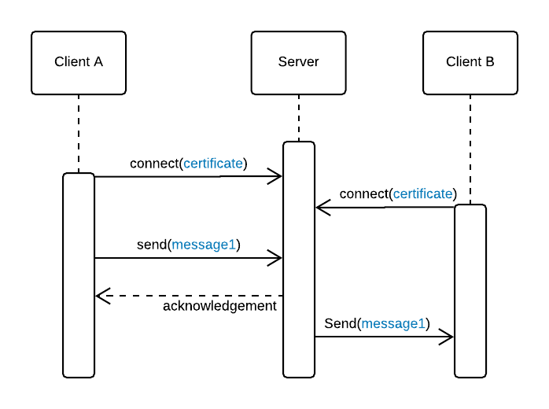
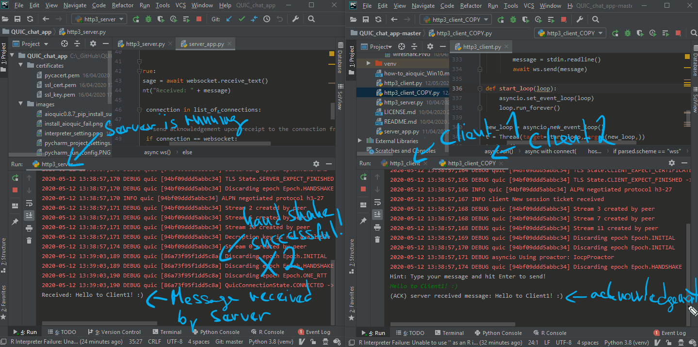
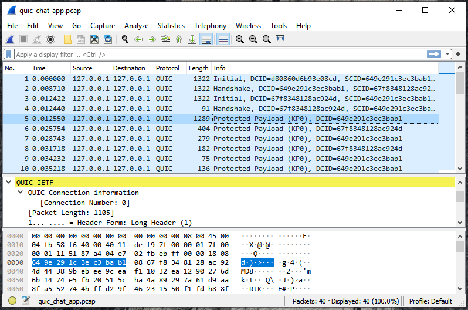

# QUIC chat app
This messaging app implements [IETF QUIC](https://quicwg.org/) protocol which is at the time of writing still in draft version. 

This project is a side product of my master degree studies of Software Design and Engineering at [University of Applied Sciences FH Campus Wien](https://www.fh-campuswien.ac.at/en/studies/study-courses/detail/software-design-and-engineering-master.html)  

This project uses the [aioquic](https://github.com/aiortc/aioquic) library which is released under the [BSD license](https://aioquic.readthedocs.io/en/latest/license.html) .

## References

- [HOW-TO aioquic on Windows10 and PyCharm](HOW-TO_aioquic_Windows10_and_PyCharm.md)

## Basic concept
Die runtime of the app can be described with the following simplified sequence diagram:



## QUIC demo



## Prerequisites
Python 3.6 and OpenSSL: 
```
sudo apt-get install python3.6
sudo apt-get install libssl-dev
```
aioquic library with its dependancies:
```
$ pip install aiofiles 
$ pip install asgiref 
$ pip install httpbin 
$ pip install starlette 
$ pip install wsproto
$ pip install aioquic
```
## Run the app 
You can test the QUIC chat app by running multi-connection server first:
```
$ python http3_server.py --certificate certificates/ssl_cert.pem --private-key certificates/ssl_key.pem
``` 
then running the first client: 
```
$ python http3_client.py --print-response --ca-certs certificates/pycacert.pem wss://localhost:4433/ws
```
and finally running the second client (another copy of the client-app) with the same parameters. 

The clients communicate with each other through the terminal. 

## QUIC protocol in Wireshark
You can inspect the data transferred through QUIC protocol for example by collecting the packages with tcpdump:
```
$ sudo tcpdump -i lo port 4433 -w quic.pcap
```
and viewing the packages collected in Wireshark: 




## Licence
Released under the BSD license.
